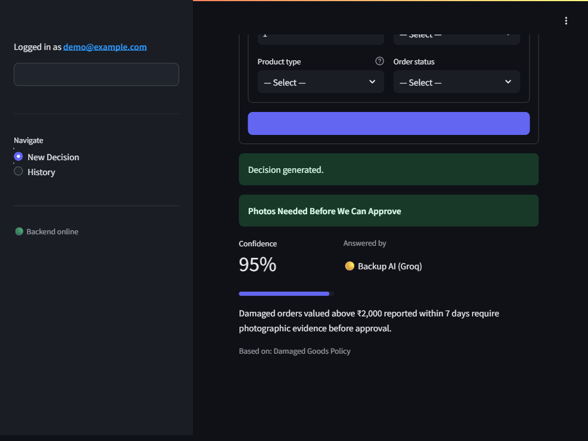

# AI Support Ticket Decision Assistant

[](https://github.com/Gurukiran10/maxsorlabs-ai-decision-api/actions/workflows/tests.yml)


A small end-to-end app: a user registers/logs in (JWT), submits a support
ticket, and receives a structured, policy-grounded AI decision (action,
confidence, reasoning, sources). Built with FastAPI, SQLite, a local RAG
pipeline over the supplied policy documents, and Gemini (with an automatic
Groq fallback).

**Quick facts:** 36 automated tests, all passing in CI · 100% (5/5) on the
supplied sample test cases · dual LLM providers with automatic failover ·
decisions cached by content hash · per-user rate limiting.

## Screenshot



## Architecture

```
Streamlit (UI)  --HTTP-->  FastAPI (auth, tickets, decisions)  -->  SQLite
                                        |
                                        v
                          retrieval.py (chunk + embed + cosine search)
                                        |
                                        v
                          decision.py (Gemini -> validated JSON -> DB)
```

Streamlit never touches the database directly — every read/write goes
through the FastAPI HTTP API.

## Setup

```bash
python -m venv venv
venv\Scripts\activate        # on Windows
# source venv/bin/activate   # on macOS/Linux

pip install -r requirements.txt

copy .env.example .env       # or `cp` on macOS/Linux
```

Edit `.env` and set `GEMINI_API_KEY` (get one at
https://aistudio.google.com/u/0/api-keys) and a random `JWT_SECRET`.

Optionally also set `GROQ_API_KEY` (free at https://console.groq.com/keys).
If present, it's used as an automatic fallback LLM provider whenever Gemini
fails — most notably free-tier quota exhaustion, which this project hit
during development. Without it, the app behaves exactly as it did before:
Gemini-only, with a safe `NEEDS_MORE_INFORMATION` fallback on failure.

Build the local embedding index for the policy documents (one-time, or
whenever `knowledge_base/` changes):

```bash
python -m scripts.ingest
```

## Running

Terminal 1 — backend:

```bash
uvicorn src.api:app --reload
```

Terminal 2 — frontend:

```bash
streamlit run streamlit_app.py
```

Open the Streamlit URL it prints, register a user, log in, and submit a
ticket under "New Decision".

## Running tests

```bash
pytest
```

Tests use an in-memory SQLite database and stub out the Gemini call, so
they run without a network connection or a valid API key. They cover the
auth flow and, notably, that one user's JWT cannot be used to read another
user's ticket (`tests/test_tickets.py::test_user_cannot_read_another_users_ticket`).

## Running the evaluation

```bash
python -m scripts.ingest   # if not already built
python -m eval.run_eval
```

This runs the pipeline against `eval/sample_test_cases.json` (from the
supplied candidate pack) and prints per-case pass/fail plus overall accuracy.
This requires a valid `GEMINI_API_KEY` since it calls the real LLM end to end.

### Full-dataset evaluation

`eval/sample_test_cases.json` is only 5 rows. `data/tickets.csv` has ~214
historical tickets with a `resolved_action` column, which is a much
stronger accuracy signal. Per `DATA_NOTES.md`, the decision pipeline never
looks up this file — `resolved_action` is only read by the eval script,
after the fact, to score what the pipeline independently decided.

```bash
python -m eval.run_full_eval --limit 20 --seed 1
```

`--limit` caps how many (randomly sampled, seeded for reproducibility) rows
are evaluated per run, since the free Gemini tier caps at 20 requests/day —
drop `--limit` to attempt all rows if you have a higher quota. Prints a
per-action-type accuracy breakdown and lists every mismatch.

## API

| Method | Endpoint         | Purpose                                   |
|--------|------------------|--------------------------------------------|
| POST   | `/register`      | Create a user account                     |
| POST   | `/login`         | Verify credentials, return a JWT          |
| GET    | `/me`            | Return the authenticated user             |
| POST   | `/tickets`       | Submit a ticket, generate an AI decision  |
| GET    | `/tickets`       | List the authenticated user's tickets     |
| GET    | `/tickets/{id}`  | Get one ticket + its decision             |
| GET    | `/health`        | Liveness check (no auth)                  |

All endpoints except `/register`, `/login`, and `/health` require
`Authorization: Bearer <JWT>`.

## Design decisions worth knowing about

- **Ticket schema is richer than the minimum spec.** The spec's minimum
  `tickets` table only lists a `message` text field, but the supplied
  policies key off concrete facts (order value, days since delivery/dispatch,
  product type, opened/unopened, order status) that can't be reliably parsed
  out of free text. The ticket form captures these as explicit structured
  fields alongside the free-text message, and the decision step is grounded
  on both. This keeps the LLM from having to guess numeric/categorical facts
  it should just be told.
- **RAG chunking is rule-per-chunk, not fixed-size windows.** The knowledge
  base docs are short numbered-list policies; splitting on each numbered rule
  keeps every chunk atomic and topically self-contained, which is far more
  precise for retrieval than sliding-window chunking would be on text this
  short.
- **No vector DB.** ~30 short chunks total — a NumPy cosine-similarity scan
  over cached embeddings is simpler, faster to set up, and just as correct
  at this scale. Embeddings are cached to `retrieval_cache/` (gitignored) so
  they aren't recomputed on every request.
- **Structured-output validation and fallback.** The LLM is prompted to
  return only JSON matching a fixed schema; the response is parsed and
  validated against a Pydantic model before it's ever persisted. One retry is
  allowed on a malformed response; if it still fails (or the model itself
  can't confidently decide), the system persists `NEEDS_MORE_INFORMATION`
  rather than guessing or crashing.
- **Same 404 for "not found" and "not yours."** `/tickets/{id}` returns 404
  in both cases so the API never confirms/denies another user's ticket IDs
  to someone who isn't authorized to see them.
- **Decisions are cached by content hash.** Identical tickets (same message +
  same structured facts) always get the same answer, served from
  `retrieval_cache/decision_cache.json` instead of paying for and re-rolling
  a fresh LLM call every time. The supplied `data/tickets.csv` genuinely
  contains repeated identical tickets from different customers, so this has
  real value, not just demo value. A failed/fallback decision is deliberately
  *not* cached, so a transient failure (rate limit, network blip) doesn't
  permanently freeze a bad answer for a ticket that could succeed on retry.
  No TTL/invalidation — reasonable at this scope; a real system would put
  this behind a proper cache with expiry tied to policy-doc changes.
- **Retrieval-confidence safety net.** Before the LLM is even called, the top
  retrieved chunk's cosine similarity is checked against a threshold (0.62,
  chosen from empirically measured scores — relevant tickets score ~0.70-0.76
  against this knowledge base, off-topic ones top out around ~0.55-0.58). If
  nothing scores above it, the ticket is answered `NEEDS_MORE_INFORMATION`
  without spending an LLM call. This doesn't rely on the model noticing on
  its own that it has no grounding for an off-topic ticket.
- **Config fails fast.** `src/config.py` uses `pydantic-settings` to validate
  `GEMINI_API_KEY`/`JWT_SECRET` at startup, not on the first request that
  happens to need them.
- **Password policy: 8-72 characters, at least one letter and one number.**
  Hashed with bcrypt via passlib (`src/auth.py`). The 72-character upper
  bound isn't arbitrary — bcrypt only uses a password's first 72 bytes and
  silently ignores the rest, so without this cap two different long
  passwords sharing the same first 72 bytes would hash identically. The
  rule is enforced in `src/schemas.py` (the actual source of truth) and
  mirrored client-side in `streamlit_app.py` for instant feedback.
- **Optional Groq fallback provider.** Gemini gets two attempts; if both
  fail and `GROQ_API_KEY` is set, two attempts go to Groq (`openai/gpt-oss-120b`)
  before finally giving up and returning `NEEDS_MORE_INFORMATION`. Groq is
  entirely separate infrastructure and quota from Google, so this is a real
  redundancy path, not just a second call against the same limit — directly
  motivated by hitting Gemini's free-tier daily cap during development.
  Without a Groq key configured, the app is unaffected and behaves exactly
  as Gemini-only.
- **Ticket + decision commit atomically.** The ticket row is flushed (gets an
  id) but not committed until its decision is also ready; if the decision
  pipeline raises, the transaction rolls back rather than leaving an
  orphaned ticket with no decision in the database.
- **`product_type`/`opened_status`/`order_status` are validated enums, not
  free strings.** Garbage in these fields would silently corrupt both the DB
  row and the text handed to the LLM prompt, so invalid values are rejected
  with a 422 instead of flowing through. (This also surfaced a real Python
  gotcha during development: `str(SomeStrEnum.MEMBER)` renders as
  `"ClassName.MEMBER"`, not the member's value — `model_dump(mode="json")`
  is used everywhere a ticket dict is built from the Pydantic model, to get
  the actual string value instead.)
- **Per-user rate limiting on `/tickets`.** A simple in-memory sliding-window
  limiter (10 requests/60s per user) protects the one endpoint that spends a
  real, quota-limited LLM call — directly motivated by hitting the Gemini
  free-tier's daily cap during development. Documented in `src/rate_limit.py`
  as intentionally single-process/in-memory at this scope; a multi-instance
  deployment would back this with Redis instead.
- **Global exception handler.** Any exception that isn't already an
  `HTTPException` is caught, logged server-side with a short error id, and
  returned to the client as a generic 500 with that id — never a raw Python
  traceback.
- **Per-call latency and token usage are logged.** Every Gemini
  `generate_content` call logs latency and prompt/output/total token counts,
  which is standard LLM-ops practice for a system whose per-request cost
  isn't fixed.
- **The frontend shows which provider actually answered.** Every decision
  carries a `provider` value (`gemini` / `groq` / `cache` / `retrieval_gate`
  / `fallback`), persisted on the `Decision` row and rendered as a badge in
  the UI. This makes the multi-provider fallback and the decision cache
  *visible* — during a demo you can watch a ticket get served by Gemini,
  then submit the same one again and watch it switch to "⚡ Cache" — instead
  of an invisible implementation detail.
- **No formal migrations, but schema drift is handled.** `src/database.py`
  adds any column that's on the SQLAlchemy model but missing from the
  actual SQLite file at startup (`_add_missing_columns`), since
  `create_all()` alone only creates missing tables, never alters existing
  ones. Reasonable at this scope; a larger project would use Alembic
  instead.

## How I'd scale this to real traffic

None of this is built — the brief is explicit about not overengineering a
small assignment, and I agree with that call. But it's worth being clear
about where the current design's edges are and what I'd actually change:

- **SQLite → Postgres.** SQLite is fine for one process and this data
  volume; it isn't built for concurrent writers across multiple app
  instances.
- **Decision cache → Redis.** The on-disk JSON cache (`decision.py`) works
  for one process; a real deployment needs it shared across instances,
  with TTL tied to policy-doc versioning instead of "forever."
- **Rate limiter → Redis-backed.** Same reasoning as the cache — the
  current in-memory limiter (`rate_limit.py`) only sees one process's
  traffic.
- **Sync Gemini/Groq SDK calls → async, off the request path.** Right now
  a ticket submission blocks on the LLM call. At real volume I'd put
  ticket creation and decision generation behind a queue (e.g. the ticket
  is created immediately with a "pending" decision, a worker calls the LLM
  and updates it, the frontend polls or gets a websocket push) so a slow
  provider doesn't hold an HTTP request open.
- **Structured JSON logging → an actual observability stack.** The
  latency/token-count logging that's there now is a good start, but at
  scale it needs to go somewhere queryable (Datadog, Grafana + Loki, etc.),
  not stdout.
- **Alembic instead of the hand-rolled column-adder** in `database.py` —
  fine for one dev iterating fast, not fine once there's real user data
  to migrate carefully.

None of this changes the actual decision logic or the RAG approach — those
would stay the same; only the infrastructure around them would change.

## Project structure

```
src/
  api.py         FastAPI app and routes
  auth.py        password hashing + JWT issue/verify
  config.py      environment/config loading
  database.py    SQLAlchemy models (users, tickets, decisions)
  decision.py    prompt building, Gemini call, validation, fallback
  retrieval.py   chunking, embedding, local vector search
  schemas.py     Pydantic request/response/LLM-output models
streamlit_app.py Streamlit UI (login/register, new decision, history)
knowledge_base/  supplied policy documents
data/            supplied historical tickets (reference only, not looked up)
eval/            sample test cases + evaluation runner
scripts/ingest.py builds the local embedding cache
tests/           pytest suite
```
